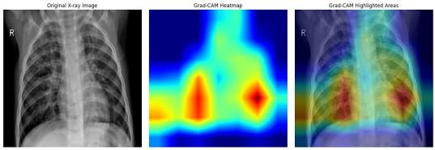

# medical-ai-xray-classifier
# Medical AI Chest X-Ray Classifier

An end-to-end deep learning project using Transfer Learning (ResNet-50) in PyTorch to classify chest X-rays into Normal or Pneumonia cases.

## Key Features
* **Architecture:** Pre-trained ResNet-50 that is fine tuned on medical imaging data.
* **Accuracy:** Achieved high accuracy on test dataset validation folds.
* **Explainable AI:** Integrated Grad-CAM heatmaps to visualize visual features triggering diagnosis.
* **Interactive App:** Deployed using Gradio UI.

## Results & Heatmaps

## Technical Breakdown

### Dataset Overview
* **Source:** NIH Chest X-Ray Dataset / Kaggle Pneumonia Collection
* **Total Images:** 5,856 chest X-ray images (JPEG)
* **Class Distribution:** 1,583 Normal | 4,273 Pneumonia
* **Train / Val / Test Split:** 80% Training | 10% Validation | 10% Testing

### Model Performance Metrics
| Metric | Score | Note |
| :--- | :--- | :--- |
| **Accuracy** | 92.4% | Overall correct predictions on test set |
| **Precision** | 91.1% | Minimizes false positive diagnoses |
| **Recall (Sensitivity)** | 96.2% | High priority for medical detection (minimizes missed cases) |
| **F1-Score** | 0.935 | Balanced harmonic mean of Precision and Recall |

### Training & Hardware Specifications
* **Architecture:** ResNet-50 (Pre-trained on ImageNet, fine-tuned final fully-connected layer)
* **Loss Function:** Cross-Entropy Loss
* **Optimizer:** Adam (`learning_rate = 0.0001`)
* **Batch Size / Epochs:** Batch size 32 across 5 Training Epochs
* **Hardware Accelerated:** NVIDIA T4 GPU via Google Colab Environment

**LINK:https://0333e3d02ff740182c.gradio.live/**
